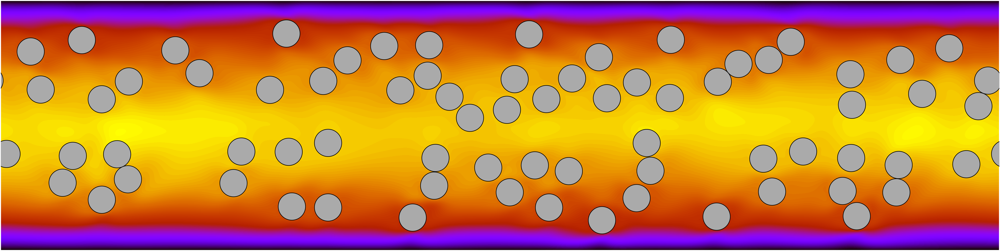

.. _example_main_cylinders:

.. include:: /references.txt

###################################
Circular objects in Poiseuille flow
###################################

Comparison with the reference data by |CHEN2012| is described, who simulated multiple cylindrical objects in plane Poiseuille flows.

*************
Configuration
*************

We consider a rectangular domain (:math:`l_x = 1, l_y = 4`), in which :math:`72` circular objects (whose radius is adjusted so that the total volume fraction leads :math:`16.9\%`) are positioned randomly.
An analytical Poiseuille flow profile is given initially, while the particles are at rest.
The liquid viscosity (Reynolds number) and the driving force are adjusted so that the maximum velocity when objects are absent (single-phase condition) leads :math:`1` and the bulk Reynolds number :math:`Re = l_x U_{max} / \nu` leads :math:`1000`.
The spatial resolution is fixed to :math:`256 \times 1024`, and :math:`1000` simulation time units are simulated.

In practice, the configuration is specified as follows:

.. literalinclude:: config/exec.sh
   :language: sh

*******
Results
*******

A snapshot of the flow field (velocity magnitude) and the instantaneous particle locations are visualised.

The averaged volume fraction :math:`\left\langle \phi \right\rangle_{y,t}` as a function of the wall-normal position is plotted as well as the reference by |CHEN2012|, which is computed in ``src/statistics/collect.c``.
The dashed line indicates the total volume fraction (:math:`16.9\%`), i.e., the integral of the red line should give this value.
A qualitative agreement (e.g., number of peaks, low concentration in the vicinity of the walls and the channel center) with the reference result is observed.

.. image:: data/vfrac.png
   :width: 800

